# flipcard
SwiftUIJam November 2021 Submission

## Light Mode (iOS)
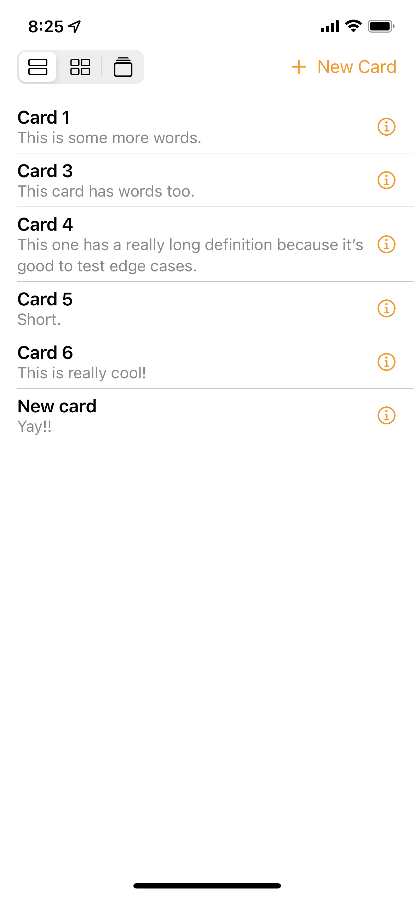
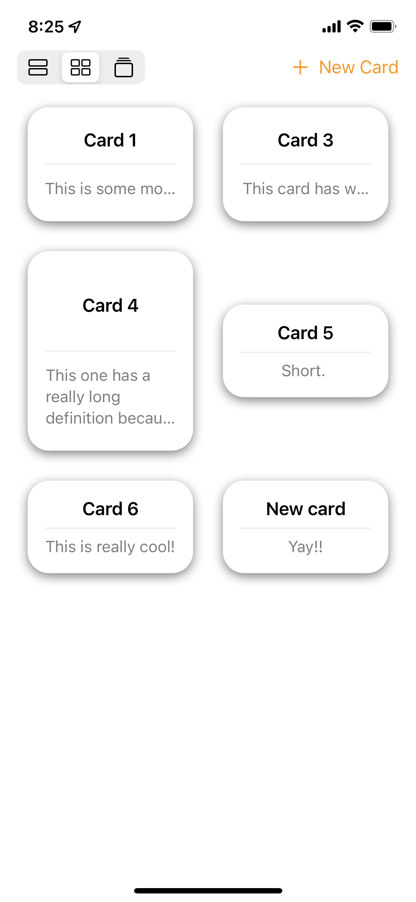
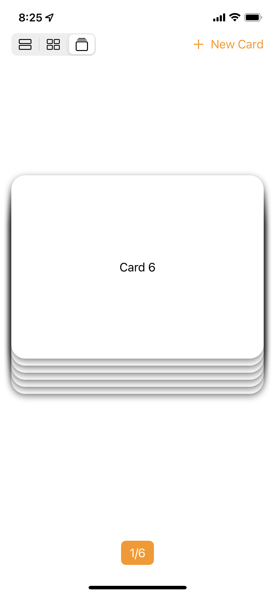
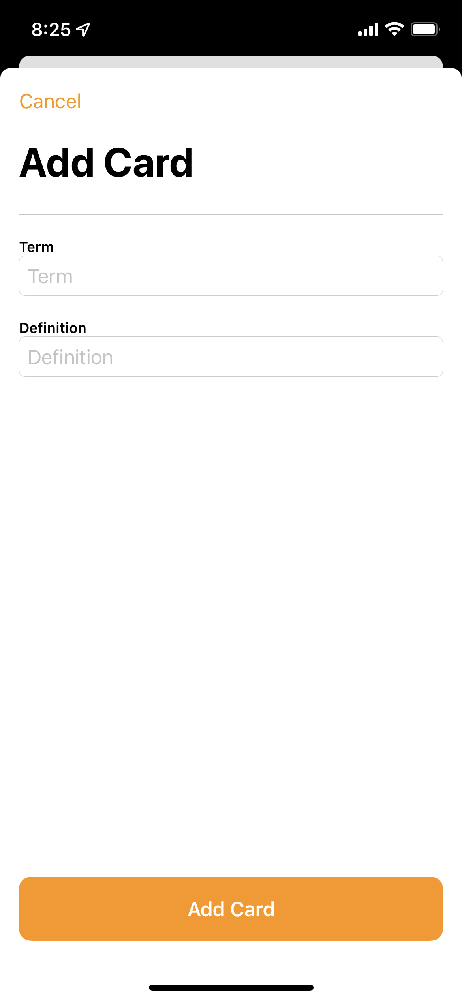

## Dark Mode (iOS)
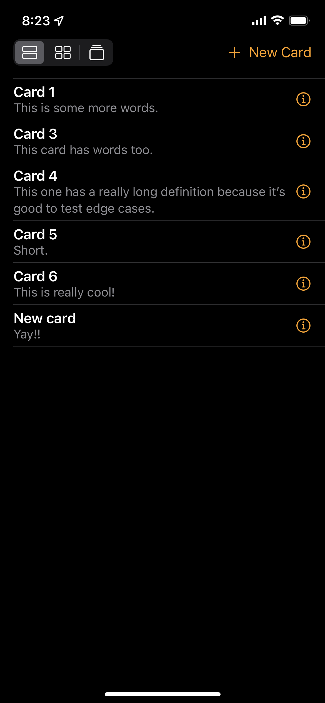
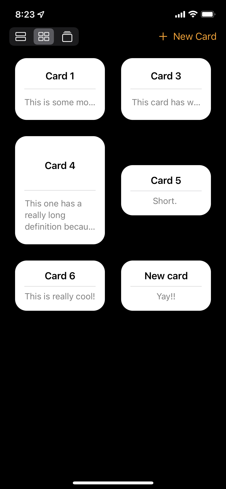
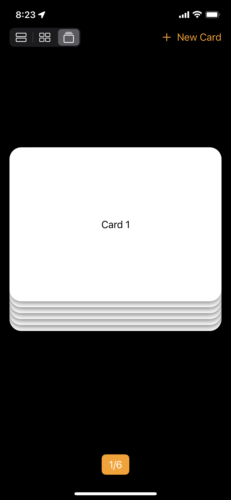
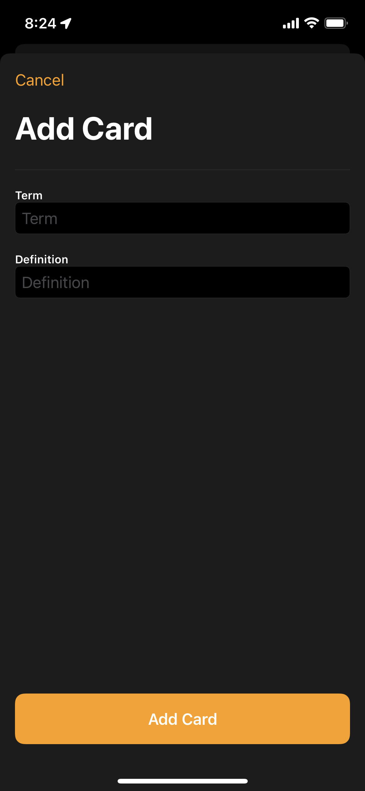

## Light Mode (MacOS)
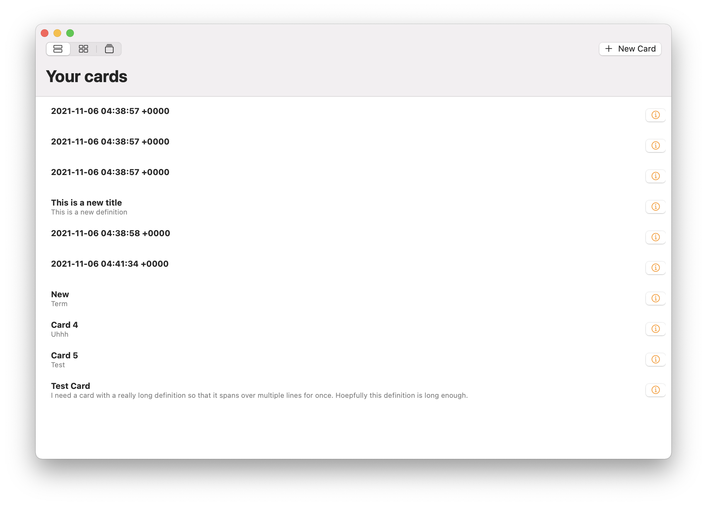
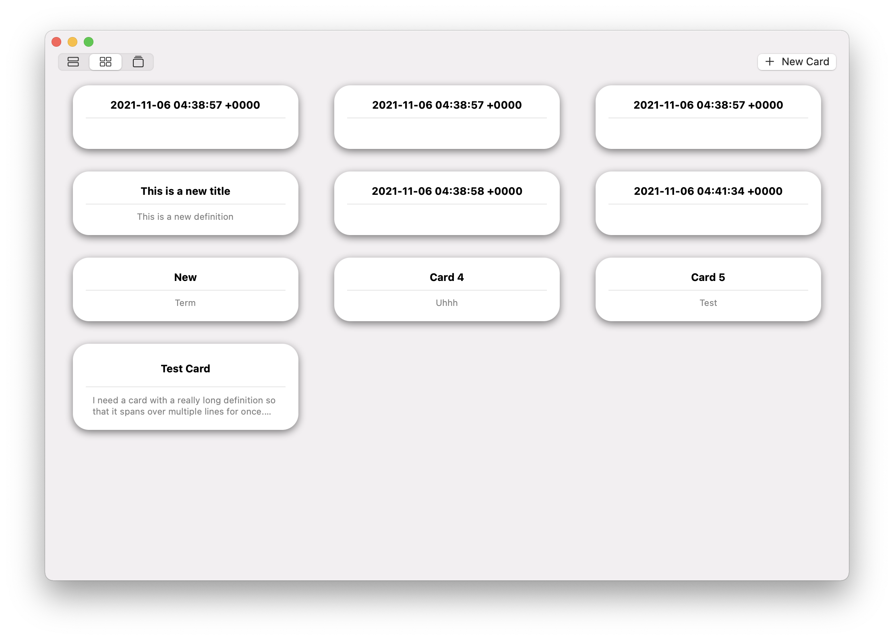
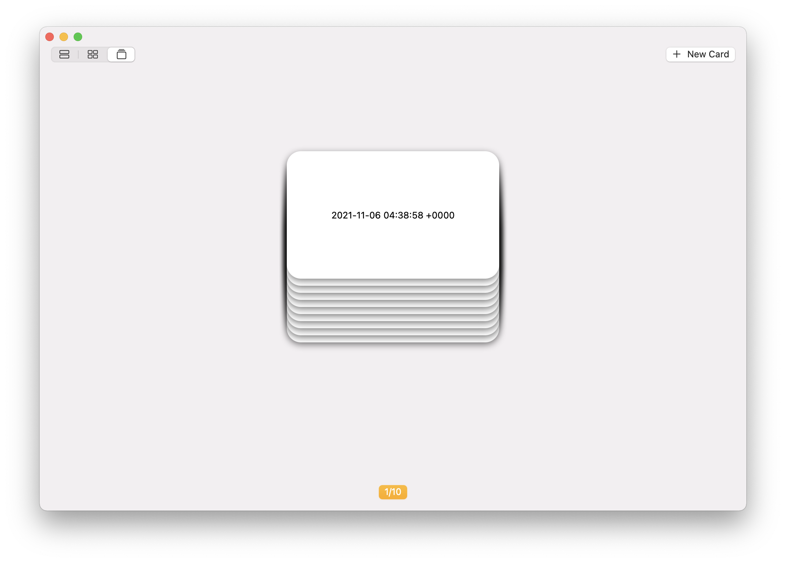
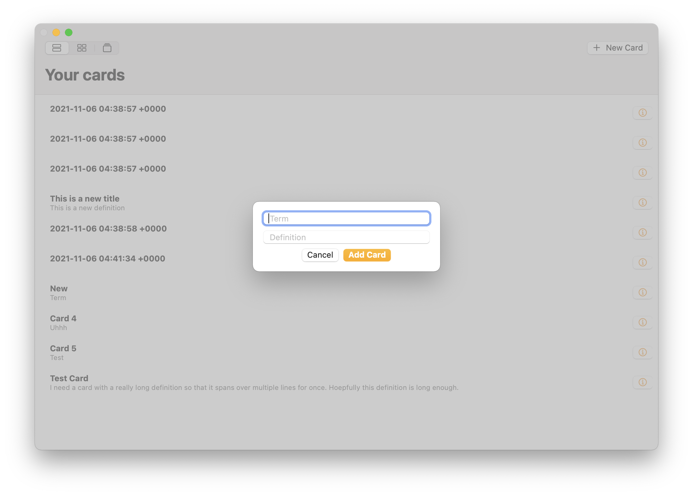

## Dark Mode (MacOS)
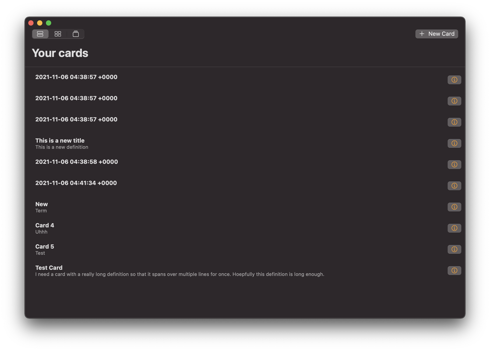
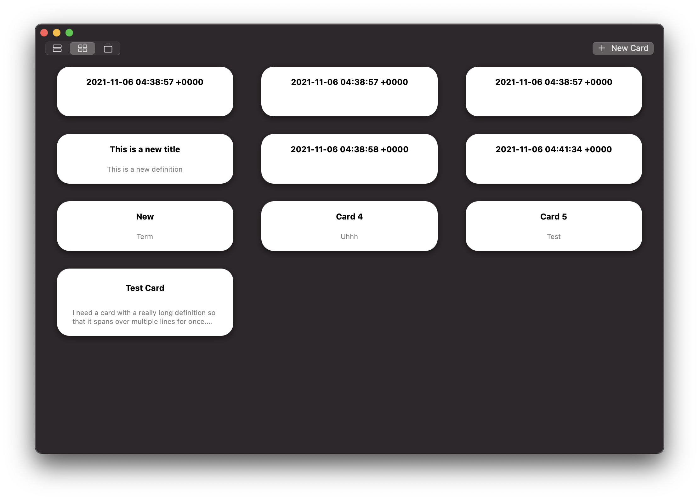
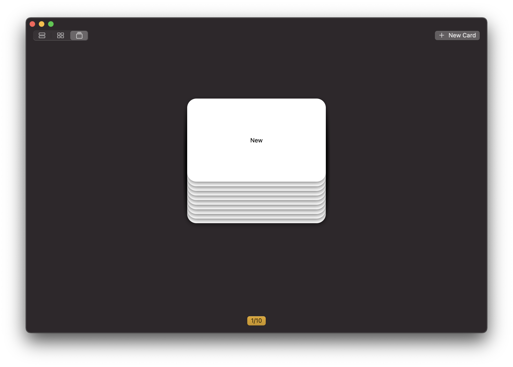
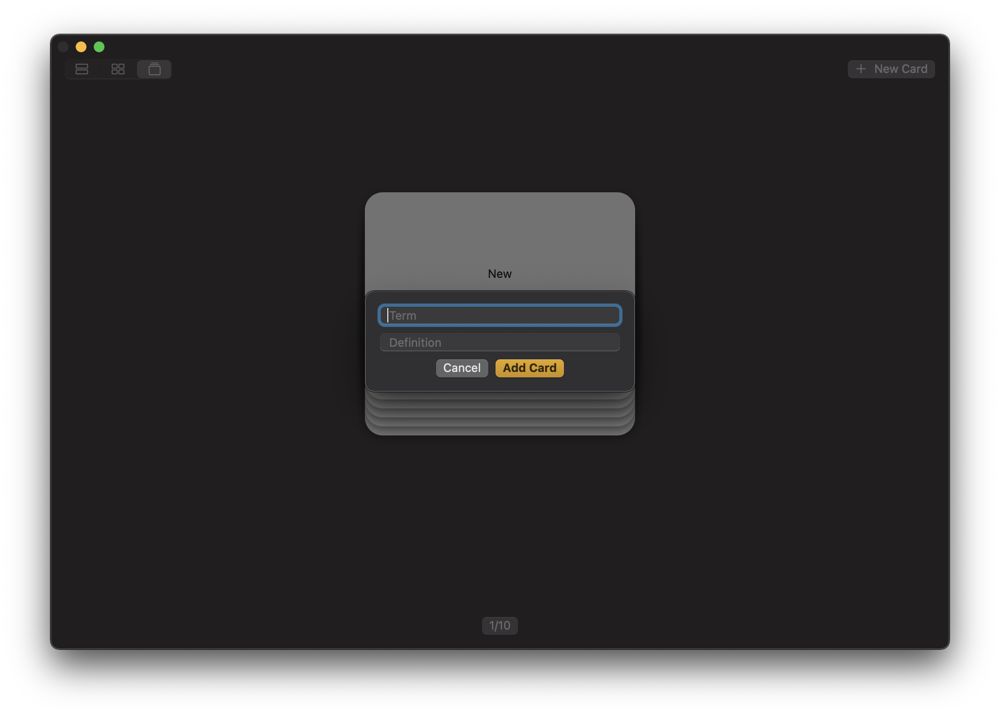

Main To-dos: 
- Make a prettier README.md
- Add reordering to the List and Grid views
- Have the Grid view display dynamically sized cards
- Allow multimedia on the cards
