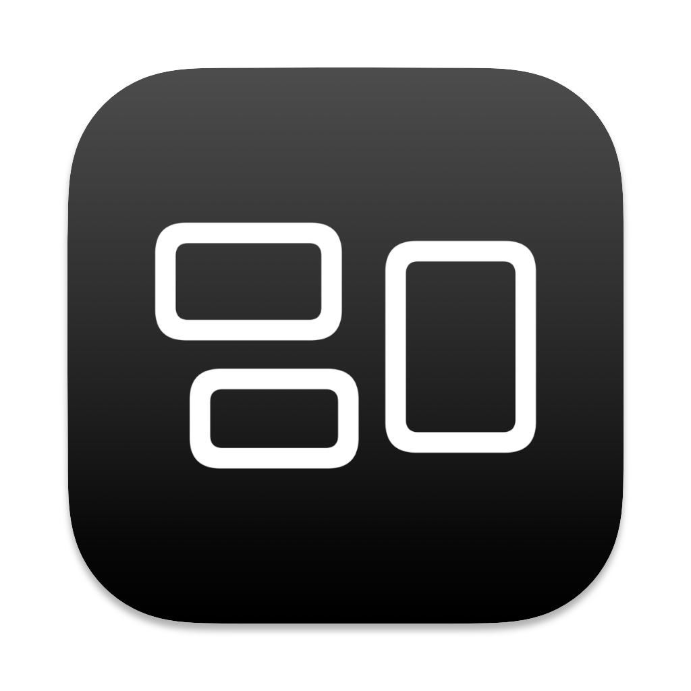

# flipcard
SwiftUIJam November 2021 Submission.

This is Flipcard: the app for reviewing your flashcards.

## App Icon
The app icon was made in Bakery by Jordi Bruin.

## Light Mode (iOS)

## Dark Mode (iOS)

## Light Mode (MacOS)

## Dark Mode (MacOS)

## Original Goal

Main To-dos: 
- Make a prettier README.md
- Add reordering to the List and Grid views
- Have the Grid view display dynamically sized cards
- Allow multimedia on the cards
